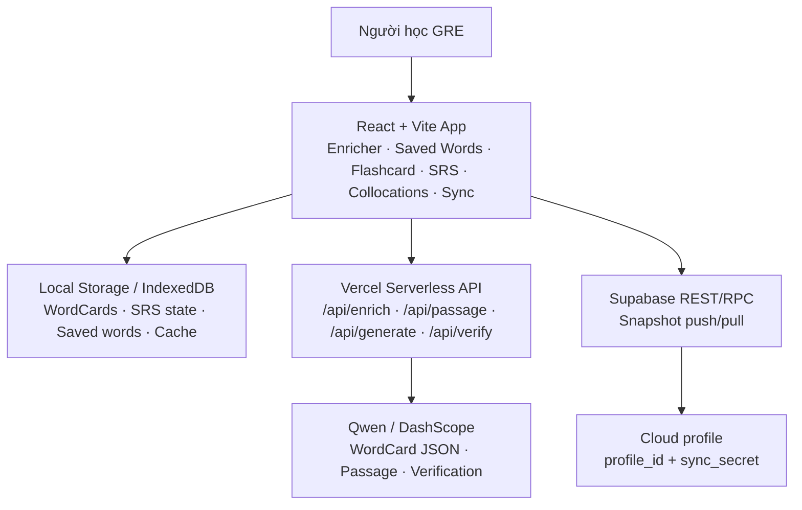

# GRE Vocabulary

<p align="center">
  
  
  
  
  
  
</p>

**GRE Vocabulary** là web app học từ vựng GRE cho người Việt: nhập một từ, AI sinh **WordCard L2** gồm nghĩa B1, giải thích tiếng Việt, ví dụ, sắc thái nghĩa, bẫy nghĩa, trái nghĩa, collocations, rồi đưa vào **flashcard + spaced repetition (SRS)** để ôn lại đúng thời điểm.

> Người học GRE thường không thiếu danh sách từ; vấn đề là thiếu một lớp giải nghĩa giúp phân biệt sắc thái, register, collocations và cách dùng tự nhiên. GRE Vocabulary biến từng từ thành một thẻ học có ngữ cảnh, dễ đọc, dễ ôn và đồng bộ được giữa laptop với điện thoại.

---

## Vấn đề (Problem)

Học từ GRE bằng bản dịch đơn lẻ dễ tạo cảm giác "biết nghĩa" nhưng chưa đủ để dùng đúng trong bài đọc, bài viết hoặc câu hỏi sentence equivalence.

* **Từ đồng nghĩa bị gom phẳng:** nhiều từ cùng dịch là "nói nhiều", "kiêu ngạo", "mơ hồ" nhưng khác register, thái độ và mức độ trang trọng.
* **Thiếu collocations tự nhiên:** biết nghĩa của từ chưa đồng nghĩa với biết cụm dùng phổ biến như `pose a threat`, `an impertinent remark`, hoặc `highly contentious`.
* **Tạo flashcard thủ công chậm:** người học phải tự tra nghĩa, ví dụ, họ từ, bẫy nghĩa và lịch ôn.
* **Ôn tập dễ quá tải:** nếu không có SRS, người học hoặc ôn quá sớm, hoặc quên mất các từ đến hạn.
* **Học đa thiết bị còn rời rạc:** laptop thuận tiện để nhập từ, điện thoại thuận tiện để ôn nhanh; dữ liệu cần đi theo người học.

## Giải pháp (Solution)

GRE Vocabulary gom các bước học từ vào một workflow nhẹ: sinh thẻ bằng AI, lưu từ, ôn flashcard, ôn đến hạn bằng SRS, luyện đoạn văn và đồng bộ cloud.

|  | Tính năng | Tóm tắt |
|---|---|---|
| AI | **WordCard tự động** | Qwen sinh thẻ từ có nghĩa B1, định nghĩa tiếng Việt, ví dụ, mnemonic, etymology, word family, synonyms theo sắc thái, traps, antonyms và collocations. |
| SRS | **Ôn từ đến hạn** | Lịch ôn kiểu SM-2: sai thì quay lại sớm, đúng thì giãn khoảng cách theo mức Khó/Tốt/Dễ. |
| Cards | **Flashcard** | Lật thẻ nhanh từ danh sách đã lưu, nghe phát âm, tự chấm và cập nhật lịch SRS. |
| Phrases | **Cụm từ / Collocations** | Gom collocations từ các từ đã lưu; mặc định chỉ hiện từ gốc, nhấn vào mới mở danh sách cụm để giảm tải thị giác. |
| Context | **Đoạn văn ngữ cảnh** | Chọn nhiều từ đã lưu để AI viết đoạn văn có đủ từ đích và tô sáng từ cần học. |
| Listening | **Drill nghe** | TTS đọc từ, người học đoán nghĩa rồi tự đánh giá. |
| Sync | **Cloud sync** | Đẩy/kéo snapshot dữ liệu lên Supabase để học tiếp trên laptop hoặc điện thoại. |

## Đối tượng sử dụng (Target User)

| Đối tượng | Nhu cầu chính | GRE Vocabulary hỗ trợ |
|---|---|---|
| **Người Việt học GRE** | Cần hiểu sâu nghĩa, sắc thái và cách dùng từ thay vì chỉ thuộc bản dịch. | Sinh WordCard L2 có giải thích tiếng Việt, collocations, bẫy nghĩa và ví dụ tự nhiên. |
| **Người học tiếng Anh nâng cao** | Muốn xây vốn từ học thuật/formal để đọc, viết và phân biệt synonyms. | Ưu tiên register, formal/academic usage và cụm từ tự nhiên khi phù hợp. |
| **Người học tự quản lý tiến độ** | Cần ôn đúng lúc trên nhiều thiết bị mà không dùng hệ thống nặng. | SRS local-first, flashcard, PWA mobile và Supabase sync cá nhân. |

## Tech Stack

**Frontend & Local-first**

| Badge | Mô tả |
|---|---|
|  | UI component cho web app học từ |
|  | Dev server và build tool |
|  | Styling qua utility và CSS variables |
|  | Lưu trữ local-first cho dữ liệu học |
|  | Cài lên điện thoại qua trình duyệt |

**AI, Sync & Deploy**

| Badge | Mô tả |
|---|---|
|  | LLM sinh WordCard, passage và câu hỏi luyện tập |
|  | Deploy frontend + API proxy `/api/*` |
|  | Đồng bộ snapshot dữ liệu cá nhân |
|  | Phát âm và drill nghe trên trình duyệt |

## Kiến trúc (Architecture)

Ứng dụng đi theo hướng **local-first**: dữ liệu học nằm trên thiết bị trước, AI và Supabase chỉ được gọi khi người học cần sinh nội dung hoặc đồng bộ.



### Design decisions

| Quyết định | Lý do |
|---|---|
| **Local-first** | App vẫn mở được dữ liệu đã lưu và ôn flashcard ngay cả khi mạng yếu. |
| **Vercel API proxy** | Giữ DashScope key ở server, tránh đưa Qwen secret vào bundle trình duyệt khi deploy công khai. |
| **Supabase snapshot sync** | Đủ nhẹ cho app cá nhân, dễ đồng bộ laptop - điện thoại mà không cần backend riêng. |
| **WordCard có schema rõ** | Giúp UI render ổn định: nghĩa, ví dụ, collocations, synonyms, traps, antonyms và SRS metadata. |
| **Flashcard + SRS tách khỏi AI** | AI chỉ hỗ trợ tạo nội dung; lịch ôn và tiến độ học do app kiểm soát. |

## Quick Start

### 1. Clone & cài dependencies

```bash
git clone https://github.com/winthebest/LexiL2.git
cd LexiL2
npm install
```

### 2. Tạo file môi trường

```bash
cp .env.example .env
```

Trên Windows PowerShell có thể dùng:

```powershell
Copy-Item .env.example .env
```

Điền tối thiểu:

```env
DASHSCOPE_API_KEY=sk-xxxxxxxxxxxxxxxxxxxx
DASHSCOPE_WORKSPACE_ID=llm-xxxxxxxxxxxx
```

Chưa có key vẫn có thể chạy app và bấm **Xem thẻ mẫu (offline)** để render thẻ mẫu từ fixture.

### 3. Chạy local

```bash
npm run dev
```

Mở địa chỉ Vite hiển thị trong terminal, thường là [http://localhost:5173](http://localhost:5173).

## Environment Variables

| Variable | Bắt buộc | Mô tả |
|---|---:|---|
| `DASHSCOPE_API_KEY` | Có, nếu dùng AI thật | Key Qwen/DashScope, đọc ở phía Node/Vercel Function. |
| `DASHSCOPE_WORKSPACE_ID` | Có, nếu workspace yêu cầu | Workspace ID của Alibaba Cloud Model Studio. |
| `QWEN_MODEL` | Không | Model sinh nội dung chính, mặc định trong code/env example. |
| `QWEN_VERIFIER_MODEL` | Không | Model dùng cho bước verify nếu bật luồng kiểm tra. |
| `VITE_SUPABASE_URL` | Không | Supabase project URL để prefill màn Đồng bộ. |
| `VITE_SUPABASE_ANON_KEY` | Không | Supabase anon key; đây là public key, được phép nằm ở frontend nếu RLS/RPC được cấu hình đúng. |
| `VITE_SYNC_PROFILE_ID` | Không | Profile ID mặc định cho cloud sync cá nhân. |
| `VITE_SYNC_SECRET` | Không khuyến nghị | Secret đồng bộ; chỉ dùng nếu app cá nhân/URL riêng và chấp nhận trade-off bảo mật. |

## Bảo mật khi deploy

* **Không deploy DashScope/Qwen key dưới dạng `VITE_*`.** Biến có tiền tố `VITE_` sẽ bị nhúng vào bundle trình duyệt.
* Trên Vercel, đặt `DASHSCOPE_API_KEY` và `DASHSCOPE_WORKSPACE_ID` trong **Project Settings -> Environment Variables**.
* Supabase anon key là public key, nhưng bảng/RPC vẫn cần policy đúng. Không dùng anon key như một bí mật.
* `sync_secret` nên để người dùng nhập trong app, không hard-code vào repo nếu app được public.
* Các API `/api/enrich`, `/api/passage`, `/api/generate`, `/api/verify` có thể tiêu tốn quota Qwen. Nếu deploy public, nên thêm kiểm soát truy cập hoặc rate limit.

Chi tiết deploy: [docs/deploy-vercel.md](docs/deploy-vercel.md). Quyết định kiến trúc bảo mật: [docs/adr.md](docs/adr.md).

## Project Structure

```text
.
├── api/                  # Vercel Serverless Functions: enrich, passage, generate, verify
├── docs/                 # PRD, ADR, API contract, WordCard spec, Supabase SQL, deploy guide
├── public/               # PWA manifest, icons, service worker assets
├── server/               # Server-side helpers for Qwen/DashScope
├── src/
│   ├── components/       # WordCard, Flashcard, SRS, sync, collocation UI
│   ├── fixtures/         # Offline sample cards
│   ├── lib/              # AI clients, store, SRS, sync, utilities
│   ├── App.jsx           # Main app shell and tabs
│   ├── index.css         # Design tokens, responsive styling
│   └── main.jsx          # React entry point
├── .env.example          # Local/dev env template
├── package.json
├── vite.config.js
└── README.md
```

<details>
<summary><strong>API Endpoints</strong> - click để xem bảng đầy đủ</summary>

<br>

| Method | Path | Description |
|---|---|---|
| POST | `/api/enrich` | Sinh WordCard cho một từ GRE bằng Qwen/DashScope. |
| POST | `/api/passage` | Sinh đoạn văn ngữ cảnh chứa các từ đã chọn. |
| POST | `/api/generate` | Sinh nội dung luyện tập theo yêu cầu của app. |
| POST | `/api/verify` | Kiểm tra/chấm đầu vào hoặc câu trả lời trong một số workflow luyện tập. |

> Hợp đồng dữ liệu và schema WordCard: [docs/contract.md](docs/contract.md) · [docs/card.md](docs/card.md).

</details>

## Trạng thái tính năng

- [x] Enricher: nhập một từ GRE và sinh WordCard bằng AI.
- [x] WordCard: nghĩa B1, tiếng Việt, ví dụ, mnemonic, etymology, word family, synonyms, traps, antonyms.
- [x] Collocations: 4-7 cụm tự nhiên, ưu tiên academic/formal/GRE khi phù hợp.
- [x] Từ đã lưu: tìm, xem, xóa và quản lý danh sách học.
- [x] Flashcard: lật thẻ, nghe phát âm, tự chấm và cập nhật lịch ôn.
- [x] SRS/Ôn tập: chỉ hiện từ đến hạn, hỗ trợ Khó/Tốt/Dễ.
- [x] Cụm từ: gom collocations, mặc định chỉ hiện từ gốc rồi mở rộng khi nhấn.
- [x] Đoạn văn: tạo passage có các từ đã chọn và tô sáng từ đích.
- [x] Drill nghe: nghe phát âm, đoán nghĩa và tự đánh giá.
- [x] Đồng bộ: Supabase push/pull cho dữ liệu `gre-l2:*`.
- [x] PWA: cài lên điện thoại sau khi deploy HTTPS.

## Tài liệu

| File | Nội dung |
|---|---|
| [docs/scope.md](docs/scope.md) | Phạm vi sản phẩm, trong/ngoài scope và Definition of Done. |
| [docs/prd.md](docs/prd.md) | Product Requirements: user stories, FR/NFR. |
| [docs/adr.md](docs/adr.md) | Architecture Decision Records, bao gồm bảo mật key và deploy. |
| [docs/contract.md](docs/contract.md) | Hợp đồng API, prompt lõi và JSON schema. |
| [docs/card.md](docs/card.md) | Đặc tả render WordCard. |
| [docs/deploy-vercel.md](docs/deploy-vercel.md) | Hướng dẫn deploy Vercel với serverless functions. |
| [docs/supabase-sync.sql](docs/supabase-sync.sql) | SQL setup cho cloud sync bằng Supabase. |

## Deploy cá nhân

Project có sẵn Vercel Serverless Functions cho `/api/enrich`, `/api/passage`, `/api/generate` và `/api/verify`, nên production có thể giữ Qwen key ở server.

Sau khi deploy HTTPS, mở URL bằng Safari trên iPhone hoặc Chrome Android, chọn **Add to Home Screen** để dùng như PWA.

## License

MIT License. Xem chi tiết tại [LICENSE](LICENSE).
